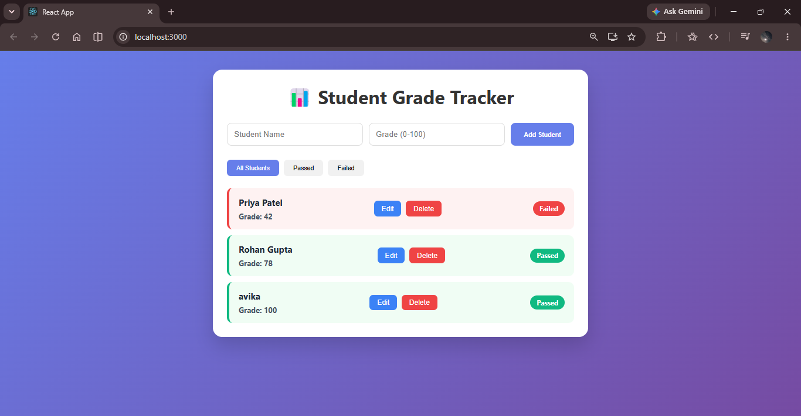

# Student Grade Tracker

A Student Grade Tracker Application built using **React Class-Based Components** and **Lifecycle Methods**.

## ✨ Features

- Add new students with name and grade
- Update student grades (inline editing)
- Mark students as Passed / Failed automatically
- Filter students (All / Passed / Failed)
- Delete students
- Responsive and clean UI with color coding
- Uses `componentDidMount`, `componentDidUpdate`, and proper state management

## 🛠️ Technologies Used

- React.js (Class Components)
- Lifecycle Methods (`componentDidMount`, `componentDidUpdate`)
- `this.state` & `setState()`
- Controlled Forms
- Conditional Rendering

## 📸 Screenshots


## 🚀 How to Run Locally

1. Clone the repository:
   ```bash
   git clone https://github.com/asyougram-hub/student-grade-tracker-react
2. vercel: https://student-grade-tracker-react-main.vercel.app/